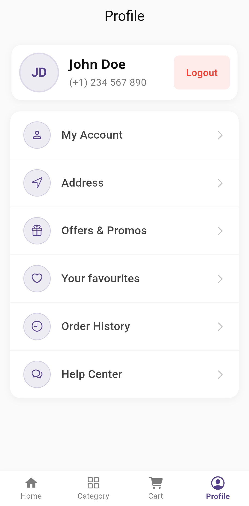

# 📚 Bazar App - Book Store UI

A beautiful and modern UI implementation of a book store mobile application built with Flutter 💙.

This project focuses on showcasing a beautiful UI, smooth animations, and a well-structured app architecture, imitating the UX of a production-ready book store application.

## ✨ Features

* **Clean and Intuitive Design:** A user-friendly interface with modern design principles.
* **Book Carousel/Slider:** Highlighting featured or trending books.
* **Detailed Book View:** A dedicated screen to view book details, ratings, and descriptions.
* **Category Filtering:** Ability to browse books by different genres or categories (e.g., Fiction, Science, Romance).
* **Search Functionality:** Quick search for books by title or author.


## 📱 Screenshots

| Home Screen | Book Detail Screen |
| :---: | :---: |
|  |  |
|  | 

## ⚙️ Technologies Used

* **Flutter:** The UI toolkit used for building the cross-platform application.
* **Dart:** The programming language used by Flutter.
* **State Management:** Riverpod + MVVM architecture


## 🚀 Getting Started

These instructions will get you a copy of the project up and running on your local machine for development and testing purposes.

### Prerequisites

You need to have the Flutter SDK installed on your machine.

* [Flutter SDK Installation Guide](https://flutter.dev/docs/get-started/install)
* An IDE like Android Studio or VS Code with the Flutter and Dart plugins installed.

### Installation

1.  **Clone the repository:**
    ```bash
    git clone https://github.com/Galadima3/bazar.git
    cd bazar
    ```

2.  **Get the packages:**
    ```bash
    flutter pub get
    ```

3.  **Run the application:**
    ```bash
    flutter run
    ```
    (Ensure you have an active emulator or a physical device connected.)


## 🤝 Contributing

This is mainly a UI showcase, but contributions are welcome! If you have suggestions for a better layout, smoother animations, or cleaner code:

1.  Fork the Project
2.  Create your Feature Branch (`git checkout -b feature/AmazingFeature`)
3.  Commit your Changes (`git commit -m 'Add some AmazingFeature'`)
4.  Push to the Branch (`git push origin feature/AmazingFeature`)
5.  Open a Pull Request

## 📄 License

Distributed under the MIT License. See `LICENSE` for more information.

## 👤 Contact

**Galadima3** - [@Galadima3X](https://twitter.com/Galadima3X)

Project Link: [https://github.com/Galadima3/bazar](https://github.com/Galadima3/bazar)
